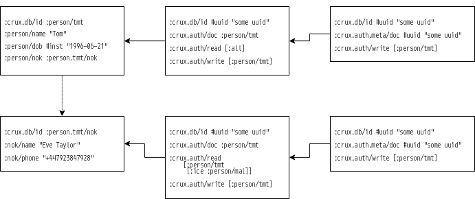

# crux-auth

This project contains a layer which wraps a crux node in an authentication
adding permissions in front of the crux api.

# Types of auth docs
:crux.auth/doc <crux.db/id> TODO better naming scheme
* auth doc
    * contains id of document in reference, a list of users who can
      :crux.auth.read/users, a list of users who can :crux.auth.write/users.
      Also :crux.auth.condition, this contains a map of reasons for accessing
      the document e.g. :emergency :death. This can be merged into the document
      if the query is supplied with this value see crux.auth/q for more details
* meta auth doc
    * contains a meta document for the auth doc detailing read and write
      permissions. e.g.  crux.auth/doc: (:crux.db/id of auth) crux.auth/read:
      [:person/tmt] crux.auth/write: [:person/tmt] TODO who can change this
      doc? for the moment just su and owner. maybe we remove this and just use
      the write users on the auth doc.
* user auth doc
    * a document which stores general user privileges e.g.  superuser has :r
      :w. everyone else by default has nil.  someone who can see all data but
      not alter it will have :r.  :w allows someone to add new documents (but
      not change).  {:crux.db/id :crux.auth.user/tmt
      :crux.auth.user/permissions [:r :w]} NOTE maybe shouldn't have global
      permissions, up to GDPR.

NOTE
it's not up to crux to validate someones credentials, just verify the supplied
identity is allowed to execute the required action

# limitations

* unable to see who changed data, just makes sure that it was someone with
  relevant permissions.
* unable to stop someone directly quering a node (this module doesn't redef
  functions

